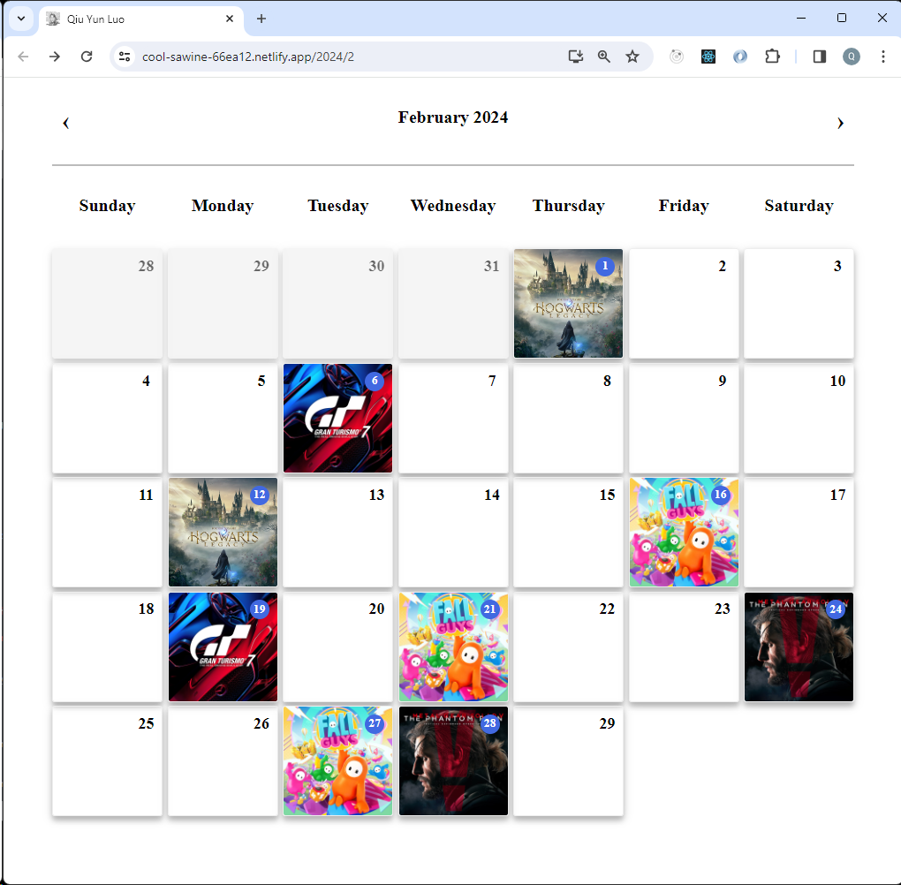
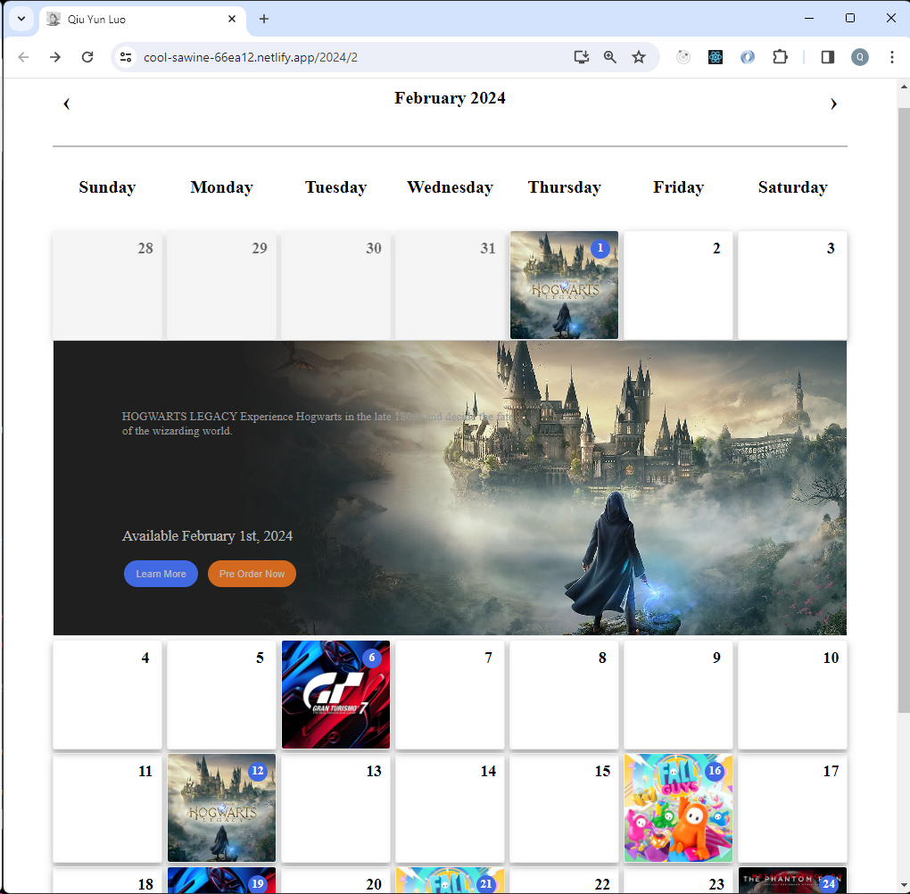

# PlayStation Games Events Calendar with React v18
[Luo, Qiu Yun](https://deft-souffle-6bce77.netlify.app/)

A React 18 & TypeScript‑based interactive monthly calendar showcasing upcoming PlayStation game release events.

**Summary:**
- URL‑based month navigation (`/2025/7`, `/2025/8`, etc.)
- Prev/Next month controls
- Automatic redirect on invalid months
- Client‑side event placement
- Clickable event cards with modal detail
- Unit tests and CI‑ready

**Live Demo:** [See it in action and try it yourself](https://deft-souffle-6bce77.netlify.app/)  
**Tech Stack:** React, React Router, TypeScript, CSS Grid, Netlify Functions, Unit Testing  
**Technologies:** React/JavaScript/TypeScript, HTML, CSS, and other aspects of UI


## 🚀 App Features: PlayStation Games Events Calendar
- 📅 Dynamic URL-driven Events Calendar:
Monthly calendar view dynamically reflects the URL path (e.g., /2025/7 for July 2025).
- 🔄 Seamless Month Navigation:
Users can navigate between months using Previous and Next buttons.
- 🚫 Invalid Path Handling:
Visiting an invalid date or pathname automatically redirects users to the current month.
- 🧩 Client-side Event Placement Algorithm:
Efficiently calculates and displays multiple game events within the correct calendar cells.
- 🔍 Interactive Event Details:
Clicking on a calendar event opens a simple pop-up/detail view showing the game's information.
- ⚛️ Built with Modern Web Technologies:
    - React.js (with React Router for navigation)
    - TypeScript for robust type safety
    - CSS Grid for responsive and flexible layout
- ✅ Unit Testing:
Ensures reliability and correctness of key components.
- 🌐 JAMstack Architecture with Serverless Functions:
Deployed on Netlify, leveraging serverless functions for API services.


#
## 🎯 Tech
- Responsive
- URL driven dynamic events calendar in a "Monthly" view
- Provide 'Previous' and 'Next' buttons to allow navigation between months
- Visiting an invalid date (pathname) will be redirected to the current date
- Month Selector stay in place when scrolling
- client-side algorithm for events placement within the calendar cells
- Clicking on a calendar event opens a simple view showing details of the event
- HTML, CSS
- Node.js
- react.js
- react dom
- react router
- typescript
- CSS Grid
- Full images pre loading avoid game details loading latency
- unit testing with RTL and Jest
- JAMstack Serverless with Netlify function API services  


## 🧪 Tests
- Calendar rendering
- Event placement logic
- Navigation / redirect handling


## ✅ Tested on latest

- Chrome
- Edge
- Firefox
- iPhone-12Pro
- iPhone-14Pro-Max
- iPhone-SE
- iPhone-XR
- iPad-Air
- iPad-Mini
- iPad-Pro
- Galaxy-Fold
- Samsung-Galaxy-A51-71
- Samsung-Galaxy-S20-Ultra
- Samsung-Galaxy-S8
- Surface-Duo
- Surface-Pro7


## 🚀 Quick Start 
To run the project locally:

```bash
git clone https://github.com/luoqiuyun/game-events-calendar.git
npm install
npm run dev
npm test
```


## 🔄 Live Demo

- https://deft-souffle-6bce77.netlify.app/
- https://deft-souffle-6bce77.netlify.app/2024/12
- https://deft-souffle-6bce77.netlify.app/2025/11
- https://deft-souffle-6bce77.netlify.app/1991/9
- https://deft-souffle-6bce77.netlify.app/2024/99


## 🔮 Future Plans
- Genre filtering
- Lazy‑loading assets
- Improved accessibility


## 🙋‍♂️ About Me
Hi, I’m Qiu Yun Luo — a passionate Frontend Engineer with over 10 years of experience building scalable, interactive web applications. I specialize in React, TypeScript, and modern web technologies, with a keen eye for UI/UX design and performance optimization.

I enjoy crafting beautiful, functional user experiences and have a strong belief that frontend development is more than just UI—it's about recreating reality in digital form. I’m also experienced in deploying JAMstack applications and working with serverless architectures.

I’m currently open to remote or contract-first opportunities where I can bring both technical leadership and hands-on coding to the team.

👉 Feel free to connect with me on [LinkedIn](https://www.linkedin.com/in/qiuyun/) or check out more of my work on [GitHub](https://github.com/luoqiuyun).


## 🔗 Screenshots






# Getting Started with Create React App

This is a [React](https://reactjs.org/) project bootstrapped with [Create React App](https://github.com/facebook/create-react-app) and structured/developed by Qiu Yun Luo.

For this app, I made use of react.js and Serverless pattern with Netlify to create a Dynamic Events Calendar application that takes in pre-defined game events and generate a monthly calendar with events randomly attached to days that are also randomly choosen.  Test it out [here](https://cool-sawine-66ea12.netlify.app/).


## Available Scripts

Getting Started

### git clone https://github.com/luoqiuyun/game-events-calendar.git

In the project directory, you can run:

### `yarn`

Installs the dependencies.

### `yarn start`

Runs the app in the development mode.<br />
Open [http://localhost:3000](http://localhost:3000) to view it in the browser.

The page will reload if you make edits.<br />
You will also see any lint errors in the console.

### `yarn test`

Launches the test runner in the interactive watch mode.<br />
See the section about [running tests](https://facebook.github.io/create-react-app/docs/running-tests) for more information.

### `yarn build`

Builds the app for production to the `build` folder.<br />
It correctly bundles React in production mode and optimizes the build for the best performance.

The build is minified and the filenames include the hashes.<br />
Your app is ready to be deployed!

See the section about [deployment](https://facebook.github.io/create-react-app/docs/deployment) for more information.

### `yarn eject`

**Note: this is a one-way operation. Once you `eject`, you can’t go back!**

If you aren’t satisfied with the build tool and configuration choices, you can `eject` at any time. This command will remove the single build dependency from your project.

Instead, it will copy all the configuration files and the transitive dependencies (webpack, Babel, ESLint, etc) right into your project so you have full control over them. All of the commands except `eject` will still work, but they will point to the copied scripts so you can tweak them. At this point you’re on your own.

You don’t have to ever use `eject`. The curated feature set is suitable for small and middle deployments, and you shouldn’t feel obligated to use this feature. However we understand that this tool wouldn’t be useful if you couldn’t customize it when you are ready for it.

## Learn More

You can learn more in the [Create React App documentation](https://facebook.github.io/create-react-app/docs/getting-started).

To learn React, check out the [React documentation](https://reactjs.org/).

### Code Splitting

This section has moved here: https://facebook.github.io/create-react-app/docs/code-splitting

### Analyzing the Bundle Size

This section has moved here: https://facebook.github.io/create-react-app/docs/analyzing-the-bundle-size

### Making a Progressive Web App

This section has moved here: https://facebook.github.io/create-react-app/docs/making-a-progressive-web-app

### Advanced Configuration

This section has moved here: https://facebook.github.io/create-react-app/docs/advanced-configuration

### Deployment

This section has moved here: https://facebook.github.io/create-react-app/docs/deployment

### `yarn build` fails to minify

This section has moved here: https://facebook.github.io/create-react-app/docs/troubleshooting#npm-run-build-fails-to-minify
